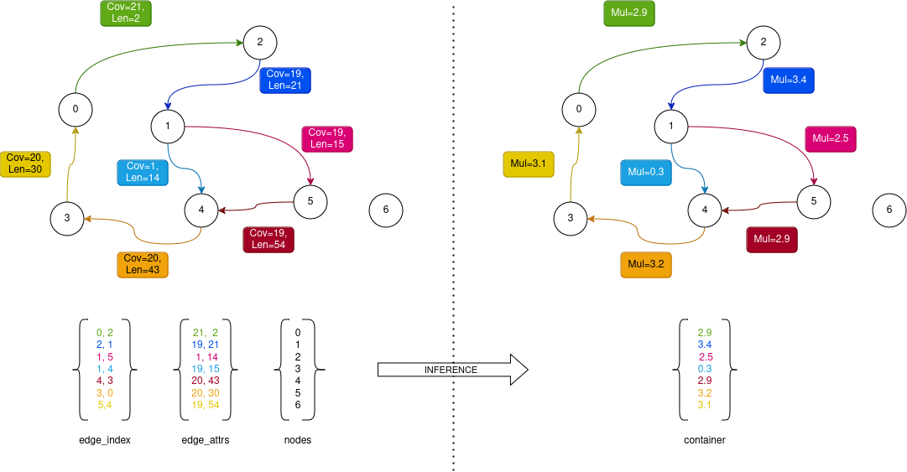

# Interface between LJA and ML inference models

In order to be able to use the LJA with machine learning based inference models it is necessary to:
 - build appropriate docker image
 - build the LJA application with `libtorch` library.

After the JumboDBG module creates the graph it is necessary to convert this graph into a format suitable for inference with ML model.
The process is illustrated in the image:



The assembly graph is iterated over and we export three torch vectors:
* edge index vector
* edge attributes vector
* nodes vector

The `edge_index` vector describes node connections in the graph.
Each row in edge index contains `id` of source and target nodes.
Note that there might be multiple edges of different (nucleotide) length connecting two same nodes.
The edge attributes vector contains coverage and length attributes of each respective edge.
The 0-th row (green) of the edge attributes vector corresponds the 0-th row (edge) in the edge index vector (also green).
Node vector in theory could also be a scalar containing the number of nodes in the graph.

Once the graph is exported, the appropriate docker command is called in order to start the inference.
Docker is used as an "application" wrapping the necessary PyTorch dependencies required for the inference using GNN based ML model.
The docker accepts command line arguments which enable modifying the configuration settings of this "executable".
Once the inference is completed, the inference results are stored as a torch vector called "container.pt" stored in the same directory where input vectors/tensors were created.
The LJA application loads this vector and converts it into a float `std::vector`.
This vector corresponds to the edge index of a graph - 0th entry in the vector corresponds to the inference result for 0-th row (edge) in the edge index.

## Building docker image
It is assumed that you have running instance of `docker engine` on your machine: https://docs.docker.com/engine/install/.
In order to build the docker image it is necessary to download the `Dockerfile` and environment description from the `github`:

Simply run the following commands:
```Bash
mkdir docker-dbg && cd docker-dbg
wget https://github.com/m5imunovic/fictional-pancake/blob/master/docker/Dockerfile
wget https://github.com/m5imunovic/fictional-pancake/blob/master/docker/environment.yaml
docker build -t dbg .
# check that the dbg:latest image appears in the docker list
docker images
# output 
# REPOSITORY   TAG       IMAGE ID       CREATED       SIZE
# dbg          latest    2fbfc3f5db03   2 weeks ago   8.85GB

```


## How to build LJA with libtorch
The easiest way to install libtorch library is to use python virtual environment.
Assuming we are in folder `ENV_PARENT` and on Ubuntu 22.04:
```Bash
sudo apt install python3.10-venv
python3.10 -m venv env
source env/bin/activate
pip3 install torch==2.2.2 --index-url https://download.pytorch.org/whl/cpu
TORCH_CMAKE_PATH=$(python -c 'import torch;print(torch.utils.cmake_prefix_path)')
```

Next we build the LJA with libtorch
```Bash
git clone https://github.com/AntonBankevich/LJA
git checkout -t origin/ML_edge_maker
cmake -DCMAKE_PREFIX_PATH=$TORCH_CMAKE_PATH
make -j lja jumboDBG
```

