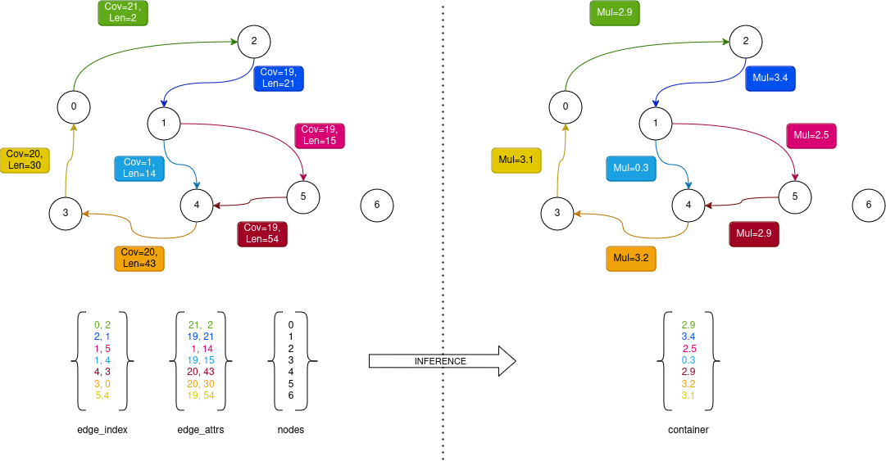

# Interface between LJA and ML inference models

In order to be able to use the LJA with machine learning based inference models, it is easiest to use singularity image.
The instructions are in further down in the document


## `LJA` - `GnnDebugger` interface

After the JumboDBG module creates the graph it is necessary to convert this graph into a format suitable for inference with ML model.
The process is illustrated in the image:



The assembly graph is iterated over and we export three torch vectors:
* edge index vector
* edge attributes vector
* nodes vector

The `edge_index` vector describes node connections in the graph.
Each row in edge index contains `id` of source and target nodes.
Note that there might be multiple edges of different (nucleotide) length connecting two same nodes.
The edge attributes vector contains coverage and length attributes of each respective edge.
The 0-th row (green) of the edge attributes vector corresponds the 0-th row (edge) in the edge index vector (also green).
Node vector in theory could also be a scalar containing the number of nodes in the graph.

Once the graph is exported, the appropriate command is called in order to start the inference. For now, we hardcoded the location
of the script to /work/gnndbg/scripts/run_inference.sh.
Container is used as an "application" wrapping the necessary PyTorch dependencies required for the inference using GNN based ML model.
It accepts command line arguments which enable modifying the configuration settings of this "executable".
Once the inference is completed, the inference results are stored as a torch vector called "container.pt" 
in the same directory where input vectors/tensors were created.
The LJA application loads this vector and converts it into a float `std::vector`.
This vector corresponds to the edge index of a graph - 0th entry in the vector corresponds to the inference result for 0-th row (edge) in the edge index.
Vector can either contain predicted probabilities if classification model is use (in range [0,1]) or edge multiplicities for regression model.
Which model will be called depends on the configuration passed on to the docker call.
User can load the results through `loadInferenceResultsProbability` and `loadInferenceResultsMultiplicity`, respectively.


## How to build LJA with libtorch
The easiest way to install libtorch library is to download zipped version of `libtorch` with required dependencies:
```Bash
wget https://download.pytorch.org/libtorch/cpu/libtorch-cxx11-abi-shared-with-deps-2.3.1%2Bcpu.zip
unzip libtorch-cxx11-abi-shared-with-deps-2.3.1+cpu.zip
TORCH_CMAKE_PATH=`pwd`/libtorch
```

Next we build the LJA with libtorch
```Bash
git clone https://github.com/AntonBankevich/LJA
git checkout -t origin/gnndebugger # alternatively, use tag `gnndebuggerpaper` for the commit version published with the paper
cmake -DCMAKE_PREFIX_PATH=$TORCH_CMAKE_PATH .
make -j lja jumboDBG
```

In order to run the inference we recommend building a singularity image. At the moment setup is quite crude so 
we recommend following steps. Create directories `data` and `work` in $HOME directory. Download LJA and `GnnDebugger`:
```Bash
cd ~/work
git clone https://github.com/m5imunovic/gnndebugger
git clone https://github.com/AntonBankevich/LJA/tree/gnndebugger
```

Store following script under path `~/data/docker/regression_cmd.sh`. Note that this is hardcoded at the moment,
so the code in `reliable_filers.hpp` should be modified accordingly. 
```Bash
"PYTHONPATH=/work/gnndebugger/src; " \
"PROJECT_ROOT=/work/gnndebugger; " \
"mamba run -n fenv python3" \
" /work/gnndebugger/src/inference.py --config-name=test_config.yaml" "--config-path /data/config"
```
Create a directory "~/data/config/" and place `config/test_config.yaml` file containing inference config inside.
Copy the model `best_model.ckpt` to path `~/data/models`

Build the image:
```Bash
cd ~/work/LJA/apptainer && bash build_apptainer.sh
```
To run the assembly using apptainer image execute command:
```
apptainer run \
	--bind $HOME/data:/data \
	--bind $HOME/data/config:/config \
    $HOME/work/LJA/apptainer/dbgc.sif \
    --diploid \
	--reads <reads.fastq> \
    -o <OUT_DIR> \
	--threads 32 
```
